Per-turn execution order for the Orbit Wars agent. Each call to `agent(obs)` runs the full pipeline below. See [Home](Home.md) for the module inventory and [Decision-Trace](Decision-Trace.md) for concrete numbers on a single turn.

## Flowchart

```mermaid
flowchart TD
    A["agent(obs)"] --> B["Parse obs\nplanets, fleets, player,\nangular_velocity, turn, comet_ids"]
    B --> C{"turn == 0\nor initial_planets is None?"}
    C -- "Yes" --> D["Cache initial_planets = planets"]
    C -- "No" --> E
    D --> E["plan_moves(planets, fleets, player,\nangular_velocity, turn, params,\ncomet_ids, initial_planets)"]
    E --> F["Partition planets\nmy_planets / neutral_planets / enemy_planets"]
    F --> G["aggression(turn)\n= aggression_max - t*(aggression_max - aggression_min)"]
    G --> H["detect_threats(my_planets, fleets,\nplayer, angular_velocity, params)\n→ list[Threat(planet_id, incoming_ships, eta)]"]
    H --> I["classify_own(planet, threats, params)\nfor each owned planet\n→ FORTRESS | FACTORY | OUTPOST | THREATENED"]
    I --> J["handle_threats(threats, owned, own_classes,\nangular_velocity, params)\n→ defense_moves  [FORTRESS/FACTORY sources only]"]
    J --> K{"should_play_defensive?\nturn >= endgame_threshold_turn\nAND my_ships/enemy_ships >= lead_margin"}
    K -- "True (endgame exit)" --> L["return defense_moves"]
    K -- "False" --> M["Exclude defense-used planets\nfrom expansion pool"]
    M --> N["plan_expansion(owned, neutrals, enemies,\nown_classes, angular_velocity, agg, params, ...)"]
    N --> O["For each non-THREATENED source planet\nwith ships >= min_garrison/agg"]
    O --> P["probe_ships = source.ships // 2"]
    P --> Q["Pre-compute opponent_fn once\n(plan_moves with blend=0 on opp player)"]
    Q --> R["For each candidate target"]
    R --> S{"target.owner == -1?"}
    S -- "neutral" --> T["classify_neutral(target, probe_ships)\n→ EASY_NEUTRAL | HARD_NEUTRAL"]
    S -- "enemy" --> U["classify_enemy(target, probe_ships, probe_eta)\n→ SOFT_ENEMY | CONTESTED_ENEMY | HARDENED_ENEMY"]
    T --> V["SKIP_COMBOS filter\n(src_class, tgt_class) in SKIP_COMBOS → skip"]
    U --> V
    V --> W["Lookup fraction = params[frac_{src}_{tgt}]\nships_to_send = source.ships * fraction * agg"]
    W --> X["can_capture? path_crosses_sun? → filter"]
    X --> Y["Greedy score\n= (eff_prod + stationary_bonus) / (eta+1)²"]
    Y --> Z{"lookahead_blend > 0\nAND initial_planets set?"}
    Z -- "Yes" --> AA["build_state → step_state × lookahead_turns\n→ score_state(state, player, ship_weight)\n→ lookahead_score"]
    Z -- "No" --> AB["lookahead_score = greedy_score"]
    AA --> AC["Normalize greedy + lookahead scores\nover all candidates for this source"]
    AB --> AC
    AC --> AD["blended = (1-blend)*norm_greedy + blend*norm_lookahead\nPick best candidate"]
    AD --> AE["Emit move: [source.id, angle_rad, ships_to_send]"]
    AE --> AF["Repeat for next source planet"]
    AF --> AG["return defense_moves + expansion_moves"]
```



## Step-by-Step Breakdown

### 1. Parse `obs`

`agent(obs)` extracts:

| Field              | Source key                                    | Type                       |
| ------------------ | --------------------------------------------- | -------------------------- |
| `planets`          | `obs["planets"]`                              | `list[Planet]` namedtuples |
| `fleets`           | `obs["fleets"]`                               | `list[Fleet]` namedtuples  |
| `player`           | `obs["player"]`                               | `int` (0 or 1)             |
| `angular_velocity` | `obs["angular_velocity"]`                     | `float` rad/turn           |
| `turn`             | `obs["step"]`                                 | `int`                      |
| `comet_ids`        | `obs["comet_planet_ids"]` via `get_comet_ids` | `set[int]`                 |

`initial_planets` is a module-level cache; set once at turn 0 and held for the entire game. Needed by the lookahead to reconstruct orbital positions.

### 2. Partition Planets

```
owned   = [p for p in planets if p.owner == player]
neutrals = [p for p in planets if p.owner == -1]
enemies  = [p for p in planets if p.owner not in (-1, player)]
```

### 3. Aggression Scaling

```python
t = min(turn, game_length) / game_length
agg = aggression_max - t * (aggression_max - aggression_min)
```

Default range: 0.917 → 0.737 over 500 turns. Higher early-game aggression means lower effective `min_garrison` and more ships sent per move.

### 4. Threat Detection (`detect_threats`)

For every enemy fleet, projects its position forward for `t ∈ [1, threat_eta_window]` turns (default 17). If the projected position is within `threat_radius` (default 5.27) of a predicted planet position, a `Threat(planet_id, incoming_ships, eta)` is appended.

### 5. Own-Planet Classification (`classify_own`)

Applied to every owned planet. Priority order:

1. **THREATENED** — if any `Threat.planet_id` matches
2. **FORTRESS** — `ships >= fortress_min_ships` (20) AND `production >= fortress_min_production` (2)
3. **FACTORY** — `production >= factory_min_production` (2)
4. **OUTPOST** — everything else

### 6. Threat Handling (`handle_threats`)

For each `Threat`, finds FORTRESS or FACTORY sources that can arrive before the attacker (with `eta_buffer` turns of slack). Sends `defense_reinforce_fraction` (60%) of source ships. Each source is used at most once.

### 7. Endgame Exit (`should_play_defensive`)

If `turn >= endgame_threshold_turn` (451) AND `my_total_ships / enemy_total_ships >= lead_margin` (1.41): returns only `defense_moves`. Expansion is skipped entirely — locks in a winning position.

### 8. Expansion (`plan_expansion`)

Planets already used for defense are excluded. For each remaining owned planet:

- Skip if `source.ships < min_garrison / agg`
- `probe_ships = source.ships // 2` (used for classification only)
- Opponent response is pre-computed once per source (not per candidate) using `plan_moves` with `lookahead_blend=0` to avoid recursion

For each candidate target:

| Step         | Detail                                                            |
| ------------ | ----------------------------------------------------------------- |
| Classify     | `classify_neutral` or `classify_enemy` using `probe_ships`        |
| Filter       | `SKIP_COMBOS` removes risky (src_class, tgt_class) pairs          |
| Fraction     | `frac_{src_class}_{tgt_class}` param → actual `ships_to_send`     |
| Validity     | `can_capture` check + sun-crossing check                          |
| Greedy score | `(effective_production + stationary_bonus) / (eta+1)²`            |
| Lookahead    | `build_state → step_state × N → score_state` (if blend > 0)       |
| Blend        | Scores are min-max normalized across all candidates, then blended |

### 9. Move Format

Each emitted move is `[planet_id: int, angle: float, ships: int]`. The Kaggle engine interprets `angle` as the launch direction in radians (standard math convention: 0 = right, π/2 = down). Multiple moves per turn are allowed — one per source planet.

### 10. Return

`defense_moves + expansion_moves` — defense moves are always prepended so they execute even if expansion is empty.

## Key Parameters Governing This Loop

| Param                    | Default | Role                                                        |
| ------------------------ | ------- | ----------------------------------------------------------- |
| `game_length`            | 500     | Aggression denominator                                      |
| `aggression_max`         | 0.917   | Early-game aggression                                       |
| `aggression_min`         | 0.737   | Late-game aggression                                        |
| `threat_eta_window`      | 17      | Turns ahead to scan for threats                             |
| `threat_radius`          | 5.27    | Proximity threshold for threat detection                    |
| `min_garrison`           | 28      | Min ships before a planet launches                          |
| `min_garrison_early`     | 6       | Min garrison at turn 0 (ramps to `min_garrison` by turn 35) |
| `endgame_threshold_turn` | 451     | Turn to enter defensive mode                                |
| `endgame_lead_margin`    | 1.41    | Ship ratio to trigger defensive mode                        |
| `lookahead_blend`        | 0.484   | Weight on lookahead score (0 = greedy only)                 |
| `lookahead_turns`        | 2       | Simulation depth                                            |

All params are in [`src/config.py`](src/config.md) and tunable via Optuna — see [Tuning-Pipeline](Tuning-Pipeline.md).
