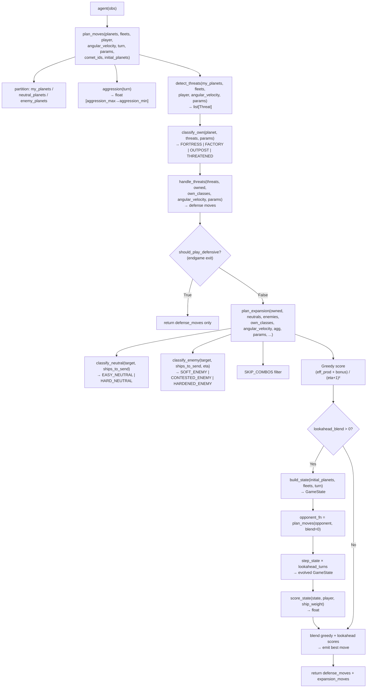

Orbit Wars — Kaggle competition bot. Goal: capture the most ships by turn 500 across orbiting planets. The bot is submitted as a single bundled `submission.py` generated by `build.py`.

## Quickstart

| Command                                                               | Purpose                              |
| --------------------------------------------------------------------- | ------------------------------------ |
| `uv run pytest tests/ --ignore=tests/test_trial_runner.py`            | Fast test suite (no Optuna)          |
| `uv run pytest tests/ -v`                                             | Full suite (requires Optuna)         |
| `uv run python run_game.py`                                           | Local game vs starter agent          |
| `uv run python trials/run_trials.py`                                  | Optuna self-play tuning (~30–60 min) |
| `python build.py`                                                     | Bundle `src/` into `submission.py`   |
| `kaggle competitions submit -c orbit-wars -f submission.py -m "desc"` | Submit to Kaggle                     |

Always use `uv run` — the project pins Python 3.11 via `.python-version`.

## Module Inventory

| File                   | Lines | Purpose                                                                                                                            |
| ---------------------- | ----- | ---------------------------------------------------------------------------------------------------------------------------------- |
| `src/agent.py`         | 13    | Entry point: `agent(obs) -> list[list]`. Parses observation, caches initial planets, calls `plan_moves`.                           |
| `src/strategy.py`      | 375   | Core decision logic: `plan_moves`, `plan_expansion`, `aggression`, classifiers, `detect_threats`, `handle_threats`, `intercept`.   |
| `src/lookahead.py`     | 201   | 1–N turn simulator: `build_state`, `step_state`, `score_state`. Data classes: `SimPlanet`, `SimFleet`, `GameState`.                |
| `src/config.py`        | 89    | 32-key `PARAMS` dict (active defaults), `SKIP_COMBOS` set, `PARAM_SPACE` bounds for Optuna.                                        |
| `src/math_utils.py`    | 84    | Orbital mechanics: `predict_planet_position`, `fleet_speed`, `turns_to_arrive`, `path_crosses_sun`, `angle_to_target`, `distance`. |
| `src/comets.py`        | 32    | Comet value scaling: `get_comet_ids`, `effective_production`.                                                                      |
| `src/endgame.py`       | 40    | Late-game defense: `should_play_defensive`, `total_ships`.                                                                         |
| `trials/run_trials.py` | —     | Optuna self-play tuning loop; promotes challengers to `champion.py` at ≥55% win rate.                                              |
| `trials/champion.py`   | —     | Best known params — auto-promoted by `run_trials.py`.                                                                              |
| `trials/benchmark.py`  | —     | Quick sanity check: champion vs original defaults (20 games).                                                                      |
| `build.py`             | —     | Concatenates `src/` modules into `submission.py` for Kaggle.                                                                       |

## Call Chain

## Key Concepts

**Planet classes (own):** `FORTRESS` (≥`fortress_min_ships` ships AND ≥`fortress_min_production` prod), `FACTORY` (≥`factory_min_production` prod), `OUTPOST` (everything else), `THREATENED` (enemy fleet inbound within `threat_eta_window`). Default thresholds: 20 ships / 2 prod (fortress), 4 prod (factory) — all Optuna-tunable.

**Target classes (neutral):** `EASY_NEUTRAL` (probe ships / target ships > `weak_ratio`), `HARD_NEUTRAL` otherwise.

**Target classes (enemy):** `SOFT_ENEMY`, `CONTESTED_ENEMY`, `HARDENED_ENEMY` — based on `ships_to_send / (target.ships + target.production * eta)` vs `weak_ratio` / `contested_ratio`.

**Aggression:** linearly scales from `aggression_max` → `aggression_min` over `game_length` turns. Acts as a multiplier on `min_garrison` (inverted) and `ships_to_send`.

**Lookahead:** optional 1–N turn forward simulation. Scores are normalized per-source-planet then blended: `(1 - blend) * norm_greedy + blend * norm_lookahead`.

## Cross-links

- [Game-Loop](Game-Loop.md) — per-turn execution order with flowchart
- [Decision-Trace](Decision-Trace.md) — annotated example turn (turn 47)
- [strategy source](src/strategy.md) | [lookahead source](src/lookahead.md) | [config](src/config.md)
