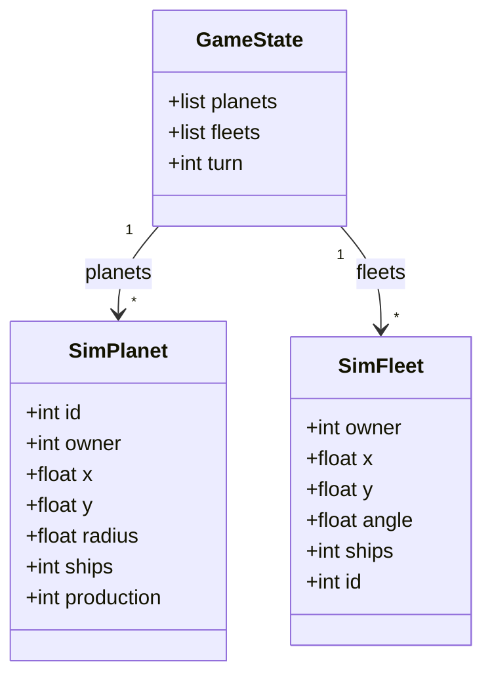

## Overview

`src/lookahead.py` is a lightweight 1–N turn forward simulator used by `plan_expansion` to score candidate moves beyond the greedy heuristic. It defines three mutable dataclasses that mirror the Kaggle engine's immutable namedtuples, plus three functions: `build_state`, `step_state`, and `score_state`.

Cross-links: [Strategy](strategy.md) | [Config](config.md) | [Home](../Home.md)

---

## Data Classes



`SimFleet.id` defaults to `-1` as a sentinel for simulator-spawned fleets. Real fleets from the Kaggle observation get their actual `id` copied in by `build_state`.

Duck-typing gotcha: the attribute names on `SimPlanet` and `SimFleet` are intentionally identical to the Kaggle engine's namedtuple field names (`Planet`, `Fleet`). This means `plan_moves` — and all strategy functions — work transparently on both the real Kaggle objects and the sim objects without any special handling.

---

## Functions

### `build_state(planets, fleets, turn) -> GameState`

```python
def build_state(planets, fleets, turn: int) -> GameState:
```

Copies the immutable Kaggle namedtuples (`Planet`, `Fleet`) into mutable `SimPlanet` / `SimFleet` dataclass instances so that `step_state` can mutate them in place. Every field is copied explicitly — no reference aliasing.

Gotcha: caller must call `build_state` before each lookahead branch that needs an independent simulation. The returned `GameState` is mutable and will be modified by `step_state`.

---

### `step_state(state, move, player, angular_velocity, initial_planets, opponent_fn) -> GameState`

```python
def step_state(
    state: GameState,
    move,
    player: int,
    angular_velocity: float,
    initial_planets,
    opponent_fn=None,
) -> GameState:
```

Simulates **one turn** forward. Mutates `state` in place and returns it. Caller should not reuse the state after calling `step_state`.

```mermaid
sequenceDiagram
    participant S as step_state
    participant P as Planets
    participant F as Fleets

    S->>P: Step 1 — Production: owned planets += production
    S->>P: Step 2 — Rotate: orbiting planets advance by angular_velocity
    S->>F: Step 3 — Our fleet: launch candidate move (deduct ships from source)
    S->>F: Step 3b — Opponent: opponent_fn(state) launches opponent moves
    S->>F: Step 4 — Move: all fleets advance one step (speed * cos/sin angle)
    S->>P: Step 5 — Combat: arrivals resolve; incumbent holds ties at 0 ships
```

**Step-by-step detail:**

1. **Production** — every planet with `owner != -1` gains `production` ships.
2. **Rotate** — each `SimPlanet` position is updated via `predict_planet_position(sim_planet, angular_velocity, 1)`. Stationary planets move negligibly.
3. **Our fleet launch** — if `move` is not `None`, the source planet's ships are decremented and a new `SimFleet` is appended to `state.fleets`. Guarded: only launches if `source.ships >= ships_to_send`.
4. **Opponent fleet launches** — if `opponent_fn` is provided, it is called with the current (post-our-launch) state. Each returned move is applied the same way: decrement source, append fleet. Guarded per move.
5. **Move** — every fleet's `(x, y)` advances by `fleet_speed(ships) * (cos(angle), sin(angle))`.
6. **Combat** — fleets that have reached a planet (within `planet.radius`) are grouped by owner. The owner with the most ships wins; the winning total minus all other totals = surviving ships. Ties break to the current owner. If `surviving > 0` the winner holds (or captures, paying the foothold cost). If the winner is the incumbent owner but `surviving == 0`, the owner still holds the planet at 0 ships. The planet only becomes neutral (0 ships) when a tie or full cancellation (`surviving <= 0`) is won by a non-incumbent.

---

### `score_state(state, player, ship_weight) -> float`

```python
def score_state(state: GameState, player: int, ship_weight: float = 0.01) -> float:
```

Scores the state from `player`'s perspective:

```
score = (my_prod - enemy_prod) + ship_weight * (my_ships - enemy_ships)
```

Only counts ships on planets (not in-flight fleets). `ship_weight` (`lookahead_ship_weight` in PARAMS, default 0.01) controls how much raw ship count matters vs production differential. Neutral planets are excluded from both sides.

---

## Gotchas

**Foothold cost.** When a planet changes hands (`surviving > 0` and `winner != planet.owner`), the simulator subtracts one extra ship: `planet.ships = surviving - 1`. This is a deliberate pessimism bias — the real Kaggle engine does not have this cost. It discourages the lookahead from over-valuing conquest moves that yield only 1-ship margins.

**Recursion cap.** `opponent_fn` is only constructed when `lookahead_blend > 0` and `initial_planets` is available; otherwise it is `None` and `step_state` skips the opponent-launch step entirely. When it is constructed, `plan_moves` is called with `greedy_params_opp = {**params, "lookahead_blend": 0.0}`, forcing the opponent's `plan_expansion` to use pure greedy scoring — so it never builds its own `opponent_fn`. The cap is enforced at the `plan_expansion` call site, not inside `step_state`.

**Duck-typing.** `SimPlanet` and `SimFleet` attribute names match the Kaggle namedtuple field names exactly. Functions like `plan_moves`, `detect_threats`, and `intercept` operate on whichever object is passed — real or simulated — without branching.

**Combat tie.** Ties break to the incumbent owner. When the winner's surviving ships equal zero because an attack exactly matches the defense, the planet stays with its current owner at `ships = 0` rather than going neutral — this avoids undervaluing defensive holds in the lookahead. A neutral planet (`owner = -1`) wins its own ties the same way and stays neutral. The planet is set to `owner = -1` with `ships = 0` only when the tie (or full cancellation, `surviving < 0`) is won by a non-incumbent — e.g., two equal-size attacker fleets cancel each other on a contested planet.

**`build_state` copy semantics.** `build_state` performs a full field-by-field copy of every planet and fleet into new dataclass instances. This is intentional — `step_state` mutates the state in place, so each lookahead branch that needs an independent trajectory must start from a fresh `build_state` call. Reusing the same `GameState` across branches will corrupt results.
