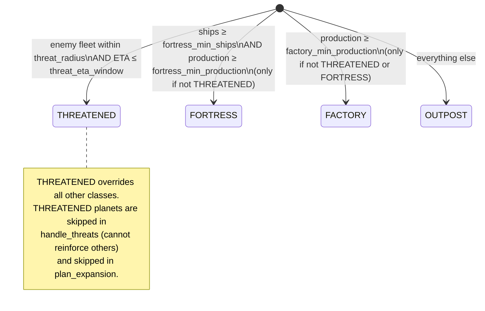

## Overview

`src/strategy.py` is the core decision module. Every turn, `plan_moves` partitions planets, computes aggression, detects threats, generates defense moves, optionally short-circuits to endgame mode, then delegates to `plan_expansion` for attack/expansion moves.

Cross-links: [Lookahead](lookahead.md) | [Config](config.md) | [Home](../Home.md)

---

## Planet Classification

### Own-planet states



All four thresholds are PARAMS-tunable: `fortress_min_ships`, `fortress_min_production`, `factory_min_production`, `threat_radius`, `threat_eta_window`.

### `classify_own(planet, threats, params) -> str`

```python
def classify_own(planet: Planet, threats: list, params: dict = PARAMS) -> str:
```

Returns `"THREATENED"` if any `Threat` in the list targets this planet. Otherwise checks FORTRESS conditions (both ships AND production), then FACTORY (production only), then falls through to `"OUTPOST"`.

### `classify_neutral(target, ships_to_send, params) -> str`

```python
def classify_neutral(target: Planet, ships_to_send: int, params: dict = PARAMS) -> str:
```

Returns `"EASY_NEUTRAL"` if `target.ships == 0` or `ships_to_send / target.ships > weak_ratio`. Otherwise `"HARD_NEUTRAL"`. Uses the probe fleet size (`source.ships // 2`) for the ratio, not the actual send amount.

### `classify_enemy(target, ships_to_send, eta, params) -> str`

```python
def classify_enemy(target: Planet, ships_to_send: int, eta: int, params: dict = PARAMS) -> str:
```

`expected_defenders = target.ships + target.production * eta`. Ratio = `ships_to_send / expected_defenders`.

- `ratio > weak_ratio` → `"SOFT_ENEMY"`
- `ratio > contested_ratio` → `"CONTESTED_ENEMY"`
- else → `"HARDENED_ENEMY"`

Gotcha: division-by-zero guard — if `expected_defenders == 0`, returns `"SOFT_ENEMY"` immediately.

---

## SKIP_COMBOS

Blocked `(source_class, target_class)` pairs — these moves are never generated:

| Source class | Target class      | Rationale                                                                             |
| ------------ | ----------------- | ------------------------------------------------------------------------------------- |
| `FORTRESS`   | `HARDENED_ENEMY`  | Fortresses are defensive anchors; attacking strongly-held enemies wastes the garrison |
| `FACTORY`    | `HARD_NEUTRAL`    | High-production planets should not bleed ships at uncertain neutral targets           |
| `FACTORY`    | `CONTESTED_ENEMY` | Factories avoid risky fights where outcome is uncertain                               |
| `FACTORY`    | `HARDENED_ENEMY`  | Factories never attack well-defended enemies                                          |
| `OUTPOST`    | `HARD_NEUTRAL`    | Outposts (low ships) cannot absorb the cost of contested neutrals                     |
| `OUTPOST`    | `CONTESTED_ENEMY` | Outposts cannot win sustained fights                                                  |
| `OUTPOST`    | `HARDENED_ENEMY`  | Outposts would be wiped out; completely blocked                                       |

---

## Public Functions

### `aggression(turn, params) -> float`

```python
def aggression(turn: int, params: dict = PARAMS) -> float:
```

Linear ramp from `aggression_max` down to `aggression_min` over `game_length` turns:

```
t = min(turn, game_length) / game_length
aggression = aggression_max - t * (aggression_max - aggression_min)
```

`t` is clamped at 1.0 so turns beyond `game_length` don't extrapolate below `aggression_min`. The result is used as a multiplier: `ships_to_send = int(source.ships * fraction * agg)` and to scale down min_garrison: `min_garrison = int(_effective_min_garrison(turn) / agg)`.

---

### `_effective_min_garrison(turn, params) -> int`

```python
def _effective_min_garrison(turn: int, params: dict) -> int:
```

Linearly interpolates from `min_garrison_early` (turn 0) to `min_garrison` (turn `garrison_ramp_turns`):

```
t = min(turn, garrison_ramp_turns) / garrison_ramp_turns
effective = int(min_garrison_early + t * (min_garrison - min_garrison_early))
```

Effect: early game uses a **low** garrison threshold, so planets attack with fewer ships on hand — **more aggressive**. As turns increase, the threshold ramps up toward `min_garrison`, requiring more ships before attacking — **more conservative**. The value is then divided by `agg` in `plan_expansion`; higher aggression further lowers the effective threshold.

---

### `is_stationary(planet) -> bool`

```python
def is_stationary(planet: Planet) -> bool:
```

Returns `True` if `orbital_radius + SUN_RADIUS >= ROTATION_RADIUS_LIMIT`. Planets beyond the rotation limit sit still — they get a `stationary_value_bonus` added to their effective production for scoring.

---

### `value_tier(planet, comet_ids, params) -> str`

```python
def value_tier(planet: Planet, comet_ids: set = frozenset(), params: dict = PARAMS) -> str:
```

Uses `effective_production` (comet-adjusted) plus `stationary_value_bonus` if applicable. Returns `"HIGH"`, `"MEDIUM"`, or `"LOW"`.

Gotcha: OUTPOST-class planets are only allowed to target `"LOW"`-tier neutrals (see `plan_expansion` filter). This prevents outposts from wasting ships on valuable neutral planets they'll likely lose.

---

### `detect_threats(my_planets, fleets, player, angular_velocity, params) -> list[Threat]`

```python
def detect_threats(
    my_planets: list[Planet],
    fleets: list[Fleet],
    player: int,
    angular_velocity: float,
    params: dict = PARAMS,
) -> list:
```

For each enemy fleet, projects its position forward `1..threat_eta_window` turns using straight-line motion (speed = `fleet_speed(fleet.ships)`). For each predicted position, checks if any own planet (at its predicted orbital position) falls within `threat_radius`. Uses a `seen` set of `(fleet.id, planet.id)` pairs to avoid double-counting the same fleet-planet pair across multiple time steps.

Returns a list of `Threat(planet_id, incoming_ships, eta)` namedtuples.

---

### `handle_threats(threats, owned, own_classes, angular_velocity, params) -> list[list]`

```python
def handle_threats(
    threats: list,
    owned: list[Planet],
    own_classes: dict,
    angular_velocity: float,
    params: dict = PARAMS,
) -> list[list]:
```

For each threat, finds a `FORTRESS` or `FACTORY` planet (not the threatened planet itself, not already dispatched) that can intercept in time (`eta <= threat.eta - eta_buffer`). Sends `int(source.ships * defense_reinforce_fraction)` ships. Skips moves through the sun.

**Gotcha — `min_garrison` guard:** before committing any reinforcement move, the candidate send count is compared against the raw `params["min_garrison"]` (not the ramped/aggression-adjusted value). If `ships_to_send < min_garrison`, the source skips reinforcing. This is distinct from `plan_expansion`'s garrison check and uses the fixed `min_garrison` threshold regardless of turn or aggression.

Gotcha: THREATENED planets are explicitly excluded from reinforcing others — `own_classes.get(source.id) not in ("FORTRESS", "FACTORY")` rejects `"THREATENED"`, `"OUTPOST"`, and any other class.

---

### `intercept(source, target, angular_velocity, ships_to_send) -> tuple[float, float, int]`

```python
def intercept(
    source: Planet, target: Planet, angular_velocity: float, ships_to_send: int
) -> tuple[float, float, int]:
```

One correction pass for orbiting targets:

1. Compute `eta` to the **current** target position (straight-line estimate).
2. Predict where target will be at `eta` turns → `(future_x, future_y)`.
3. Recompute `eta` to `(future_x, future_y)`.
4. Re-predict target position at the updated `eta`.
5. Return `(future_x, future_y, eta)`.

The single correction pass accounts for orbital movement during transit. No convergence loop — just two calls to `turns_to_arrive` and two to `predict_planet_position`.

---

### `can_capture(ships_to_send, target, eta) -> bool`

```python
def can_capture(ships_to_send: int, target: Planet, eta: int) -> bool:
```

Returns `True` if `ships_to_send > expected_defenders`:

- Neutral planets: `expected_defenders = target.ships` (neutrals don't produce)
- Enemy planets: `expected_defenders = target.ships + target.production * eta`

Gotcha: strict `>` (not `>=`), so an exact tie is treated as a failure to capture.

---

### `path_crosses_sun()` (imported from `math_utils`)

Gotcha: segments within `SUN_RADIUS=10` of `CENTER=(50, 50)` are blocked. Both `handle_threats` and `plan_expansion` call this check and skip any move whose straight-line path would cross the sun exclusion zone.

---

### `plan_expansion(...) -> list[list]`

```python
def plan_expansion(
    owned: list[Planet],
    neutrals: list[Planet],
    enemies: list[Planet],
    own_classes: dict,
    angular_velocity: float,
    agg: float = 1.0,
    params: dict = PARAMS,
    comet_ids: set = frozenset(),
    initial_planets=None,
    fleets=None,
    player: int = 0,
    turn: int = 0,
) -> list[list]:
```

Greedy expansion with optional lookahead blending. One move per owned planet.

**Greedy score formula:**

```
eff_prod = effective_production(target, comet_ids, comet_value_multiplier)
bonus    = stationary_value_bonus  if target is stationary  else 0
greedy_score = (eff_prod + bonus) / (eta + 1) ** 2
```

Lower ETA and higher effective production → higher score. The `(eta+1)^2` denominator strongly favors nearby targets.

**Lookahead blend:**

When `lookahead_blend > 0` and `initial_planets` / `fleets` are provided:

1. The **opponent function is pre-computed once per source planet** (not per candidate). This is a performance optimization — computing the opponent's response is expensive, and it doesn't change between candidates from the same source.
2. The opponent function forces `lookahead_blend=0.0` (`greedy_params_opp`) to prevent infinite recursion.
3. For each candidate move, `step_state` is called once (T+1). For `lookahead_turns > 1`, additional steps simulate both players greedily, with fresh opponent responses computed from the **evolved** state at each step.
4. After all candidates are scored, greedy scores and lookahead scores are **min-max normalized independently** across the candidate set for this source planet:
   ```
   ng = (g - lo_g) / (hi_g - lo_g + 1e-9)
   nl = (l - lo_l) / (hi_l - lo_l + 1e-9)
   final = (1 - blend) * ng + blend * nl
   ```
5. The candidate with the highest `final` score is selected.

Gotcha: if only one candidate exists, or `blend == 0.0`, selection falls back to raw greedy score (no normalization needed).

**Additional filters applied per candidate:**

- Skip `THREATENED` source planets
- Skip if `source.ships < min_garrison` (adjusted by aggression)
- Skip `(src_class, tgt_class)` in `SKIP_COMBOS`
- Skip if `fraction` param is missing for the class combo (e.g., undefined combinations)
- Skip if `not can_capture(ships_to_send, target, eta)`
- Skip if `path_crosses_sun(...)`
- OUTPOST sources skip non-`"LOW"` value-tier neutral targets

---

### `plan_moves(planets, fleets, player, angular_velocity, ...) -> list[list]`

```python
def plan_moves(
    planets: list[Planet],
    fleets: list[Fleet],
    player: int,
    angular_velocity: float,
    turn: int = 0,
    params: dict = PARAMS,
    comet_ids: set = frozenset(),
    initial_planets=None,
) -> list[list]:
```

Top-level entry point called each turn.

1. Partition planets into `owned`, `neutrals`, `enemies`.
2. Compute `agg = aggression(turn, params)`.
3. `detect_threats` → classify own planets → `handle_threats` → defense moves.
4. If `should_play_defensive(...)`, return defense moves only (endgame short-circuit).
5. Remove defense-used planets from the expansion pool.
6. Call `plan_expansion` for the remaining owned planets.
7. Return `defense_moves + expansion_moves`.

---

### Utility filters

```python
def my_planets(planets: list[Planet], player: int) -> list[Planet]
def neutral_planets(planets: list[Planet]) -> list[Planet]
def enemy_planets(planets: list[Planet], player: int) -> list[Planet]
```

Simple list comprehensions. `neutral_planets` matches `owner == -1`; `enemy_planets` excludes both `-1` and `player`.
